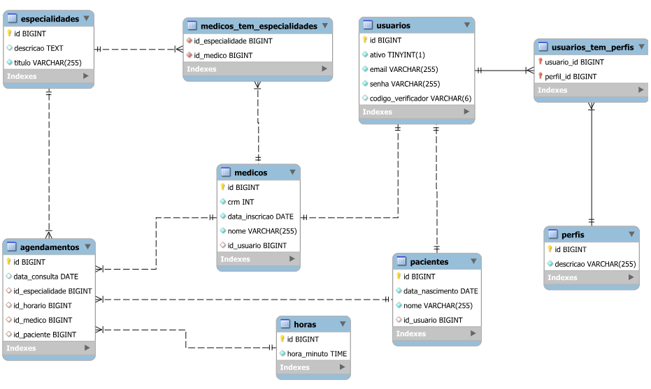

<h1 align="center">🔗 Projeto Web com Spring Boot e Spring Security</h1>

<h2 align="center">Curso Udemy: Spring Boot & MVC com Spring Security e Thymeleaf</h2>

**📌 Introdução**

Este projeto faz parte do curso Primeiros Passos no Desenvolvimento Web com Spring Boot, Spring MVC, JPA, Spring Security e Thymeleaf, ministrado na Udemy pelo professor [Marcio Ballem](https://www.linkedin.com/in/mballem/). O objetivo principal é desenvolver uma aplicação web utilizando Spring Boot, explorando as funcionalidades do Spring MVC, JPA, Spring Security e Thymeleaf.

---

**🎯 Objetivo**

Com este projeto, tive a oportunidade de aprender a desenvolver uma aplicação web segura e funcional utilizando Spring Boot. Durante o desenvolvimento, aprofundei meus conhecimentos em autenticação e autorização de usuários com Spring Security, integração com banco de dados via JPA/Hibernate, além do uso do Thymeleaf para renderização dinâmica do front-end. Também implementei funcionalidades essenciais, como Ajax para interações assíncronas, confirmação de cadastro por e-mail, recuperação de senha e restrição de logins simultâneos.

---

🛠️ Tecnologias Utilizadas

**🚀 Back-end:**

- ☕ Java 8+

- 🌱 Spring Boot 3

- 🌐 Spring MVC

- 🔐 Spring Security 6

- 🗃️ Spring Data JPA

- ⚙️ Hibernate

- 🏛️ MySQL

- ✉️ JavaMailSender

- 🖋️ SpringTemplateEngine

---

**🎨 Front-end:**

- 🎨 HTML5, CSS3, Bootstrap

- 📜 JavaScript, jQuery, Ajax

- 🖥️ Thymeleaf

---

**🗄️ SGBD (Sistemas de Banco de Dados):**

- 🏛️ MySQL Workbench

- 🐘 PostgreSQL

---

**💻 IDEs e Ferramentas de Desenvolvimento:**

- 🖥️ Visual Studio Code (Ícone típico do VS Code)

- 🏗️ IntelliJ IDEA (Ícone do IntelliJ)

- ⚙️ Spring Tools Suite (STS) (Ícone associado ao STS)

---

**📊 Modelo Relacional:**

   

**🔐 Segurança**

O sistema implementa os seguintes recursos de segurança:

- 🔑 Autenticação baseada em login e senha

- 🛡️ Autorização por meio de perfis de usuários

- 📧 Confirmação de cadastro via e-mail

- 🔑📩 Recuperação de senha via e-mail

- 🚫 Restrição de logins simultâneos

- 🔄 Função "Remember Me"

---

**🌍 Deploy e Hospedagem**

O projeto foi implantado na plataforma Heroku, permitindo que esteja disponível online para demonstração. Embora o deploy não tenha sido abordado no curso, utilizei meu conhecimento prévio para configurar a aplicação, garantindo sua execução em um ambiente na nuvem.

| **Acesse o projeto online:** |  |
|------------------------------|-----------------------------------------------------------------------------------------------------------------------------------------------------------------------|

---

**✅ Conclusão**

Este sistema de agendamento de consultas oferece um ambiente seguro e funcional para usuários e administradores. Durante o desenvolvimento, tive a oportunidade de aprender e aplicar na prática diversas tecnologias, como Spring Boot, Spring Security, JPA, Thymeleaf e JavaMailSender, sob a orientação do professor [Marcio Ballem](https://mballem.com/cursos/).

A experiência proporcionou um aprendizado sólido em autenticação, autorização, persistência de dados e boas práticas no desenvolvimento web com Java. Além disso, a implementação de recursos como recuperação de senha, confirmação de cadastro via e-mail e "Remember Me" reforçou a importância da segurança no sistema.

Esse projeto pode evoluir para a construção de uma API REST, permitindo a integração com frameworks modernos como Angular, além da implementação de notificações automáticas e suporte a múltiplos idiomas, tornando-o ainda mais robusto e completo.

---

| 🌎 LinkedIn | 👤 **Autor** |
|------------|---------------|
| [LinkedIn](https://www.linkedin.com/in/albert-backend-java-spring-boot/) | [Albert Silva](https://www.linkedin.com/in/albert-backend-java-spring-boot/) |
